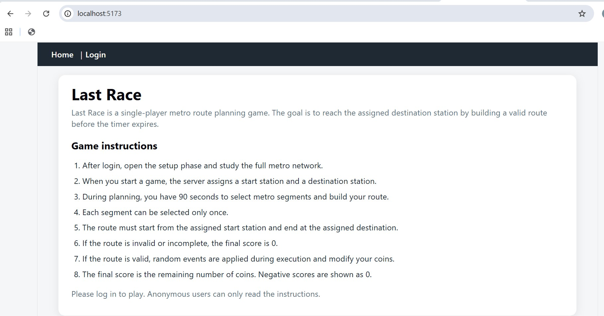
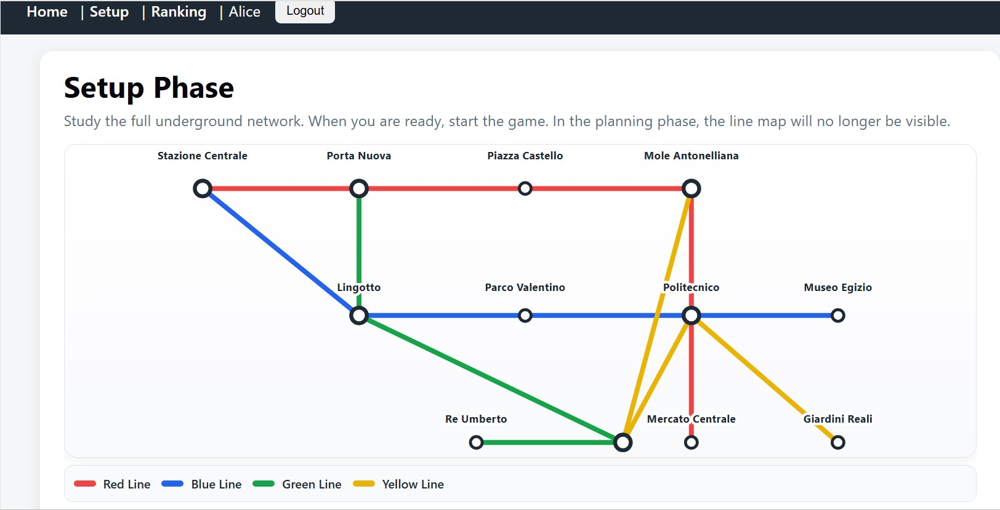
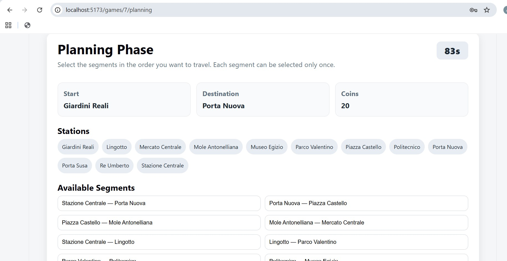
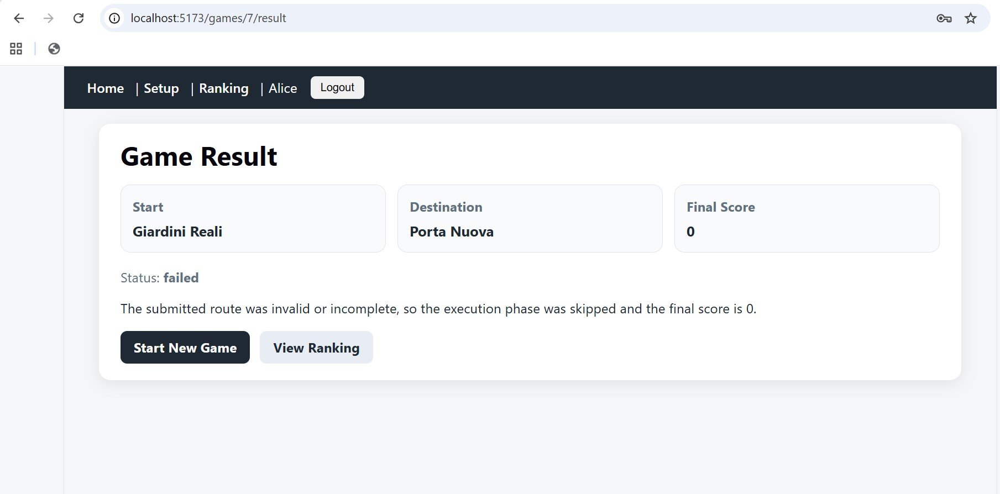
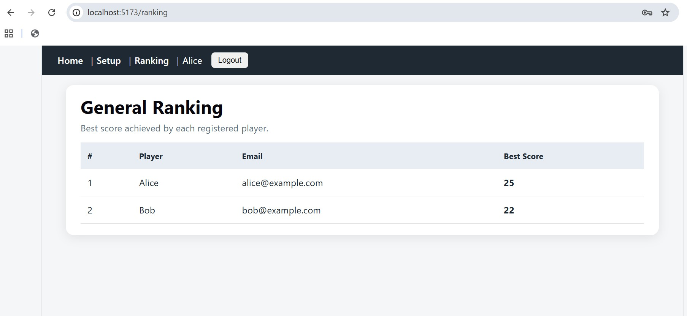

# Exam #1: "Last Race"

## Student: s351966 ALKUBAISI AMEER

# Last Race

Last Race is a single-player web application game based on a metro network.
The player studies the full network during the setup phase, then receives a random start station and destination station. During the planning phase, the player must build a route by selecting metro segments before the timer expires. The server validates the submitted route and, if valid, executes it by applying random events that modify the player's coins.

## Technologies

* React
* React Router
* Node.js
* Express
* SQLite
* Passport.js
* Session cookies

## Running the application

The project uses the two-server development pattern.

### Server

```bash
cd server
npm install
nodemon index.js
```

The server runs on:

```text
http://localhost:3001
```

### Client

```bash
cd client
npm install
npm run dev
```

The client runs on:

```text
http://localhost:5173
```

## Login credentials

The application does not provide user registration. The database is pre-populated with registered users.

| Email                                      | Password |
| ------------------------------------------ | -------- |
| [alice@example.com](mailto:alice@example.com) | alicepwd |
| [bob@example.com](mailto:bob@example.com)     | bobpwd   |
| [carol@example.com](mailto:carol@example.com) | carolpwd |

Passwords are not stored in clear text. The database stores a salt and a hashed password for each user.

## Application behavior

### Anonymous users

Anonymous users can only:

* read the public instructions page
* access the login page

Anonymous users cannot access setup, planning, result, ranking, or game APIs.

### Registered users

Logged-in users can:

* see the setup phase
* study the full metro map
* start a new game
* plan a route
* submit the route
* see the result page
* see the ranking page
* log out

## Game phases

### 1. Instructions phase

The home page contains the game instructions. This page is public and can be accessed by anonymous users.

### 2. Setup phase

The setup page shows the full metro network as a metro-style map.
The player can study the lines, stations, connections, and interchange stations before starting the game.

### 3. Planning phase

After starting a game, the server randomly assigns:

* a start station
* a destination station

The assigned destination is reachable from the start station with a minimum distance of at least three segments.

During planning, the player sees:

* the start station
* the destination station
* the available station names
* the list of all selectable segments
* a 90-second timer
* the selected route

The player submits an ordered list of segment IDs to the server.

### 4. Execution phase

If the route is valid, the server executes it segment by segment.

For each segment:

* one random event is selected
* the event modifies the number of coins
* the step is stored in the database

The initial number of coins is 20.

### 5. Result phase

The result page shows:

* game status
* start station
* destination station
* final score
* execution steps
* random events
* coin variation

If the route is invalid or incomplete, execution is skipped and the final score is 0.
If the final amount of coins is negative, the stored and displayed score is 0.

### 6. Ranking phase

The ranking page shows the best score achieved by each registered user.

## Main React routes

| Route                       | Description                | Access          |
| --------------------------- | -------------------------- | --------------- |
| `/`                       | Public instructions page   | Public          |
| `/login`                  | Login page                 | Public          |
| `/setup`                  | Setup phase with metro map | Logged-in users |
| `/games/:gameId/planning` | Planning phase             | Logged-in users |
| `/games/:gameId/result`   | Result page                | Logged-in users |
| `/ranking`                | General ranking            | Logged-in users |

## API endpoints

### Public APIs

| Method | Endpoint                  | Description         |
| ------ | ------------------------- | ------------------- |
| POST   | `/api/sessions`         | Login               |
| GET    | `/api/sessions/current` | Get current session |
| DELETE | `/api/sessions/current` | Logout              |

### Protected APIs

| Method | Endpoint                    | Description                    |
| ------ | --------------------------- | ------------------------------ |
| GET    | `/api/network/full`       | Full network for setup phase   |
| GET    | `/api/network/planning`   | Planning network data          |
| GET    | `/api/ranking`            | Ranking                        |
| POST   | `/api/games`              | Create a new game              |
| GET    | `/api/games/:id/planning` | Get planning data for a game   |
| POST   | `/api/games/:id/route`    | Submit and execute a route     |
| GET    | `/api/games/:id/result`   | Get result and execution steps |

Protected APIs use session-based authentication. If the user is not authenticated, the server returns HTTP 401.

## Database

The application uses SQLite. The database file is:

```text
server/last_race.sqlite
```

The database is initialized by:

```text
server/init-db.js
```

The main tables are:

| Table             | Purpose                                                   |
| ----------------- | --------------------------------------------------------- |
| `users`         | Registered users with salted and hashed passwords         |
| `stations`      | Metro stations                                            |
| `lines`         | Metro lines                                               |
| `line_stations` | Ordered stations for each metro line                      |
| `segments`      | Direct connections between adjacent stations              |
| `events`        | Random events with coin effects                           |
| `games`         | Created games, assigned stations, status, and final score |
| `game_steps`    | Execution details for each played route                   |

## Database access layer

The backend uses a DAO layer:

```text
server/dao.js
```

The DAO contains all SQL queries and separates database access from Express route logic.

The flow is:

```text
React component
→ API.js
→ Express route
→ DAO function
→ SQLite database
```

## Authentication

Authentication is implemented with Passport.js using the local strategy.

The login flow is:

1. The client sends email and password to `POST /api/sessions`.
2. Passport retrieves the user from the database.
3. The server verifies the password using the stored salt and hash.
4. If the credentials are valid, a session is created.
5. The browser receives a session cookie.
6. Later protected requests include the session cookie automatically.

The backend protects private APIs using an `isLoggedIn` middleware.

## Screenshots

### Public instructions page



### Setup phase





### Planning phase



### Result page



### Ranking page



## AI usage

I used ChatGPT as a development assistant to support the implementation of the project.
The tool was used to discuss the project structure, database schema, backend API design, React component organization, authentication flow, and debugging.
All generated code was reviewed, adapted, tested, and integrated manually.
